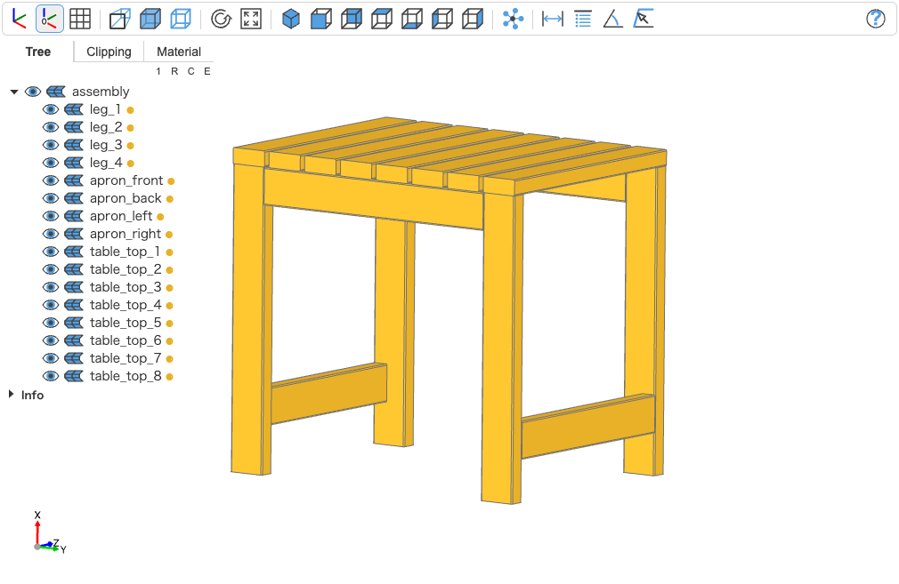

# nichiyou-daiku (日曜大工)

[](https://github.com/ar90n/nichiyou-daiku/actions/workflows/ci.yml)
[](https://codecov.io/gh/ar90n/nichiyou-daiku)
[](https://www.python.org/downloads/)
[](https://www.apache.org/licenses/LICENSE-2.0)


A domain-specific CAD system for DIY woodworking, built on the [MO-CAD (Manufacturing Oriented CAD)](https://caddi.tech/archives/4104) concept. Design furniture using a simple DSL that represents real-world construction techniques with standard lumber sizes.

Following the "Worse Is Better" philosophy, nichiyou-daiku prioritizes practical usability over theoretical perfection, making it easy to design and build furniture that can actually be constructed with common tools and materials.

## Quick Example

Design a simple table using our DSL

```dsl
// Simple Table Design with Comments
// Author: nichiyou-daiku team
// Date: 2025-07-30

// Define the four legs of the table
// Each leg is 720mm tall
(leg_1:2x4 =720)  // Front left leg
(leg_2:2x4 =720)  // Front right leg
(leg_3:2x4 =720)  // Back left leg
(leg_4:2x4 =720)  // Back right leg

// Define the aprons that connect the legs
// These provide structural support
(apron_front:2x4 =622)  // Front apron
(apron_back:2x4 =622)   // Back apron
(apron_left:2x4 =524)   // Left side apron
(apron_right:2x4 =524)  // Right side apron

// Define the table top
(table_top_1:2x4 =600)
(table_top_2:2x4 =600)
(table_top_3:2x4 =600)
(table_top_4:2x4 =600)
(table_top_5:2x4 =600)
(table_top_6:2x4 =600)
(table_top_7:2x4 =600)
(table_top_8:2x4 =600)

// Front apron connections
leg_1 -[LB>0 DB>0]- apron_front
leg_2 -[RF>0 TF>0]- apron_front

// Back apron connections
leg_3 -[LB>0 DB>0]- apron_back
leg_4 -[RF>0 TF>0]- apron_back

// Side apron connections
leg_1 -[BR<100 DB<0]- apron_left
leg_3 -[FR<100 TB<0]- apron_left
leg_2 -[BL<100 DF<0]- apron_right
leg_4 -[FL<100 TF<0]- apron_right

// Table top connections
table_top_1 -[BD<0 TF<0]- leg_1
apron_front -[RF<12.571 BT<0]- table_top_2
apron_front -[RF<114.142 BT<0]- table_top_3
apron_front -[RF<215.713 BT<0]- table_top_4
apron_front -[RF<317.284 BT<0]- table_top_5
apron_front -[RF<418.855 BT<0]- table_top_6
apron_front -[RF<520.426 BT<0]- table_top_7
table_top_8 -[BD<0 TF<0]- leg_2
```

View results with ocp-viewer

```bash
$ nichiyou-daiku view example/simple_table_compact.nd
```



Generate a report with material list and cut optimization

```bash
$ nichiyou-daiku report example/simple_table_compact.nd -o table_report.md
```

The generated report is following.

```markdown
# Woodworking Project Report

*Generated on 2025-07-30 05:24*

## Project Overview

- **Total Pieces**: 16
- **Lumber Types**: 1 (2x4)
- **Total Volume**: 33,725,304 mm³
- **Estimated Weight**: ~16.9 kg (assuming pine density)


## Bill of Materials

| ID | Type | Length (mm) | Width (mm) | Height (mm) | Volume (mm³) |
|----|------|------------|-----------|------------|-------------|
| apron_left | 2x4 | 524 | 89 | 38 | 1,772,168 |
| apron_right | 2x4 | 524 | 89 | 38 | 1,772,168 |
| table_top_1 | 2x4 | 600 | 89 | 38 | 2,029,200 |
| table_top_2 | 2x4 | 600 | 89 | 38 | 2,029,200 |
| table_top_3 | 2x4 | 600 | 89 | 38 | 2,029,200 |
| table_top_4 | 2x4 | 600 | 89 | 38 | 2,029,200 |
| table_top_5 | 2x4 | 600 | 89 | 38 | 2,029,200 |
| table_top_6 | 2x4 | 600 | 89 | 38 | 2,029,200 |
| table_top_7 | 2x4 | 600 | 89 | 38 | 2,029,200 |
| table_top_8 | 2x4 | 600 | 89 | 38 | 2,029,200 |
| apron_front | 2x4 | 622 | 89 | 38 | 2,103,604 |
| apron_back | 2x4 | 622 | 89 | 38 | 2,103,604 |
| leg_1 | 2x4 | 720 | 89 | 38 | 2,435,040 |
| leg_2 | 2x4 | 720 | 89 | 38 | 2,435,040 |
| leg_3 | 2x4 | 720 | 89 | 38 | 2,435,040 |
| leg_4 | 2x4 | 720 | 89 | 38 | 2,435,040 |


## Shopping List

### Lumber Required

- **2x4**: 16 pieces, total 10.0 meters


## Purchase Recommendations

### 2x4 Lumber (Available: 2440mm, 3050mm, 3660mm)
Optimal purchase
- 3 × 2440mm boards
- 1 × 3660mm boards
Total waste: 1008mm (9.2%)

## Optimized Cut List

### 2x4 Boards

**Board 1** (3660mm):
- Cut 720mm → leg_1
- Cut 720mm → leg_2
- Cut 720mm → leg_3
- Cut 720mm → leg_4
- Cut 622mm → apron_front
- Waste: 158mm

**Board 2** (2440mm):
- Cut 622mm → apron_back
- Cut 600mm → table_top_1
- Cut 600mm → table_top_2
- Cut 600mm → table_top_3
- Waste: 18mm

**Board 3** (2440mm):
- Cut 600mm → table_top_4
- Cut 600mm → table_top_5
- Cut 600mm → table_top_6
- Cut 600mm → table_top_7
- Waste: 40mm

**Board 4** (2440mm):
- Cut 600mm → table_top_8
- Cut 524mm → apron_left
- Cut 524mm → apron_right
- Waste: 792mm
```

## Features

### DSL & CLI Tools
- 📝 Simple, readable DSL for furniture design
- 🛠️ Command-line tools for validation, reporting, and 3D export
- 📊 Automatic bill of materials generation
- 📐 Cut optimization to minimize waste
- 📑 Markdown reports with shopping lists
- 🎯 Export to STL/STEP for 3D printing or CNC

### Core Library
- 🪵 Support for standard lumber sizes (2x4 and 1x4)
- 🔗 Flexible connection system with precise offset control
- 📐 3D visualization with build123d (optional)
- 🧩 Piece-oriented design matching real woodworking
- 📊 Graph-based assembly representation
- 🎯 Type-safe Python API with full type hints

## Installation

```bash
# Basic installation
pip install nichiyou-daiku

# With visualization support
pip install "nichiyou-daiku[viz]"

# Development installation with uv
uv pip install -e ".[viz]"
```

> **Note** The visualization feature requires build123d, which currently has limited support for ARM64/aarch64 platforms. Core functionality works on all platforms.

## Development

### Setup

This project uses [uv](https://github.com/astral-sh/uv) for dependency management.

```bash
# Clone the repository
git clone https://github.com/ar90n/nichiyou-daiku.git
cd nichiyou-daiku

# Install development dependencies
uv sync --dev

# Install with visualization support
uv sync --all-extras
```

### Running Tests

```bash
# Run tests with coverage
uv run pytest --cov=nichiyou_daiku --cov-report=term-missing

# Run specific test file
uv run pytest tests/core/test_piece.py -v

# Run with doctest
uv run python -m doctest src/nichiyou_daiku/core/piece.py
```

### Code Quality

```bash
# Format code
uv run ruff format src/ tests/

# Lint code
uv run ruff check src/ tests/

# Type checking
uv run pyright src/

# Run all checks
make lint
```

### Quality Assurance

This project uses Dagger for CI/CD pipelines. The Quality Assurance pipeline includes

- ✅ **Testing**: pytest with 90% minimum coverage + docstring tests
- 🎨 **Code Formatting**: ruff formatter
- 🔍 **Linting**: ruff static analysis
- 🏷️ **Type Checking**: pyright type verification
- 📦 **Building**: Python package distribution

#### Running QA Locally

```bash
make ci-local
```

#### GitHub Actions

The Quality Assurance pipeline automatically runs on
- Push to main branch
- Pull requests
- Manual workflow dispatch

See the [ci/](ci/) directory for pipeline implementation details.

## Examples

Check out the `examples/` directory for complete working examples

- **`simple_table.py`** - A basic four-legged table demonstrating fundamental connections
- **`basic_joints.py`** - Different joint types (T-joint, butt joint, corner joint)
- **`corner_angle.py`** - Complex corner connections with precise angle control
- **`utils.py`** - Helper functions for creating common structures
- **`resource_demo.py`** - Demonstrates resource extraction and bill of materials
- **`report_demo.py`** - Shows report generation with cut optimization

### Visualizing with build123d

```python
from nichiyou_daiku.core.assembly import Assembly
from nichiyou_daiku.shell import assembly_to_build123d
from ocp_vscode import show

# Convert model to 3D assembly
assembly = Assembly.of(model)
compound = assembly_to_build123d(assembly)

# Visualize in OCP CAD Viewer
show(compound)
```

### Resource Extraction

Extract bill of materials from your models to understand lumber requirements

```python
from nichiyou_daiku.shell.resources import extract_resources

# Extract resources from a model
resources = extract_resources(model)

# Get summary information
print(resources.pretty_print())
# Output: piece counts, total lengths by type, volume

# Export as JSON
json_data = resources.model_dump_json(indent=2)

# Access detailed information
for piece_type, count in resources.pieces_by_type.items():
    total_length = resources.total_length_by_type[piece_type]
    print(f"{piece_type.value}: {count} pieces, {total_length}mm total")
```

### Report Generation

Generate comprehensive markdown reports with shopping lists and cut optimization:

```python
from nichiyou_daiku.shell.report_generator import generate_markdown_report

# Generate report with custom standard lengths
custom_lengths = {
    PieceType.PT_2x4: [2400.0, 3000.0, 3600.0],  # metric lengths
    PieceType.PT_1x4: [1800.0, 2400.0, 3000.0],
}

report = generate_markdown_report(
    resources,
    project_name="My Table Project",
    standard_lengths=custom_lengths,
    include_cut_diagram=True
)

# Save report
with open("project_report.md", "w") as f:
    f.write(report)
```

The report includes:
- Project overview with total materials needed
- Detailed bill of materials table
- Shopping list aggregated by lumber type
- Purchase recommendations with optimal board usage
- Cut diagrams showing how to minimize waste

### DSL Support (Domain-Specific Language)

nichiyou-daiku supports a Cypher-inspired DSL for more concise model definitions

```dsl
// Simple shelf design with comments
(left_side:2x4 =800)    // 800mm tall
(right_side:2x4 =800)
(shelf:2x4 =600)        // 600mm wide shelf

// Connections using compact notation with dowel joints
left_side -[RT>100 FT<50 D(4.0, 20.0)]- shelf    // Dowel joint
right_side -[LT>100 FT<50 D(4.0, 20.0)]- shelf   // Dowel joint
```

#### DSL Features

- **Comments**: Single-line comments with `//`
- **Compact piece syntax**: `(id:type =length)` instead of JSON
- **Compact connection syntax**: `[FF<100 TD>50]` for face+offset pairs
- **Face abbreviations**: T(op), D(own), L(eft), R(ight), F(ront), B(ack)
- **Connection types**: `V` for vanilla (default), `D(radius, depth)` for dowel joints

#### DSL CLI Tools

```bash
# Validate DSL syntax
nichiyou-daiku validate furniture.nd

# Generate markdown report
nichiyou-daiku report furniture.nd -o report.md

# View 3D model (requires build123d)
nichiyou-daiku view furniture.nd

# Export to STL/STEP formats
nichiyou-daiku export furniture.nd -f stl
nichiyou-daiku export furniture.nd -o model.step --fillet-radius 10
```

See the `examples/nd_files/` directory for complete DSL examples.

## Python API

For programmatic access, you can use the Python API directly

```python
from nichiyou_daiku.core.piece import Piece, PieceType
from nichiyou_daiku.core.model import Model, PiecePair
from nichiyou_daiku.core.anchor import Anchor
from nichiyou_daiku.core.connection import Connection
from nichiyou_daiku.core.geometry import FromMin, FromMax

# Create lumber pieces
horizontal_beam = Piece.of(PieceType.PT_2x4, 800.0, "beam")
vertical_post = Piece.of(PieceType.PT_2x4, 400.0, "post")

# Define connection using the simplified API
connection = Connection(
    lhs=Anchor(
        contact_face="top",
        edge_shared_face="front",
        offset=FromMin(value=100)
    ),
    rhs=Anchor(
        contact_face="down",
        edge_shared_face="front",
        offset=FromMin(value=50)
    )
)

# Create a model with connected pieces
model = Model.of(
    pieces=[horizontal_beam, vertical_post],
    connections=[(PiecePair(base=horizontal_beam, target=vertical_post), connection)]
)
```

## Project Structure

```
nichiyou-daiku/
├── src/
│   └── nichiyou_daiku/
│       ├── core/           # Core data models
│       │   ├── piece.py    # Lumber piece definitions
│       │   ├── model.py    # Assembly graph model
│       │   ├── connection.py # Connection specifications
│       │   ├── assembly/   # 3D assembly generation
│       │   │   ├── models.py, projection.py
│       │   │   ├── joints.py
│       │   │   └── builder.py
│       │   └── geometry/   # Geometric primitives
│       │       ├── face.py, edge.py, corner.py
│       │       ├── coordinates.py, dimensions.py
│       │       └── offset.py
│       ├── dsl/            # DSL parser and transformer
│       │   ├── parser.py   # Lark-based DSL parser
│       │   ├── grammar.py  # DSL grammar definition
│       │   └── transformer.py # AST to model conversion
│       ├── cli/            # Command-line interface
│       │   ├── dsl_cli.py  # Main CLI entry point
│       │   └── commands/   # CLI commands
│       │       ├── validate.py, report.py
│       │       ├── view.py, export.py
│       └── shell/          # External integrations
│           ├── build123d_export.py
│           └── report_generator.py
├── examples/               # Example projects
│   ├── *.py               # Python examples
│   └── nd_files/*.nd      # DSL examples
├── tests/                  # Test suite
└── ci/                     # CI/CD pipeline (Dagger)
```

## Contributing

1. Fork the repository
2. Create a feature branch (`git checkout -b feature/amazing-feature`)
3. Write tests first (TDD approach)
4. Implement your feature
5. Run quality checks (`make lint` or `uv run ruff check`)
6. Commit your changes (`git commit -m 'feat: Add amazing feature'`)
7. Push to the branch (`git push origin feature/amazing-feature`)
8. Open a Pull Request

### Pull Request Guidelines

To ensure your contributions are properly categorized in release notes, please follow these PR title conventions

#### PR Title Format
Your PR title should follow the pattern `<type>: <description>`

- **feat:** New features or functionality
  - Example: `feat: Add support for 1x4 lumber sizes`
- **fix:** Bug fixes
  - Example: `fix: Correct joint position calculation for angled connections`
- **docs:** Documentation updates
  - Example: `docs: Add assembly guide for complex joints`
- **refactor:** Code restructuring without changing functionality
  - Example: `refactor: Simplify connection validation logic`
- **style:** Code style/formatting changes
  - Example: `style: Apply consistent naming to geometry modules`
- **chore:** Maintenance tasks, dependency updates
  - Example: `chore: Update pydantic to 2.12.0`
- **test:** Test additions or modifications
  - Example: `test: Add edge cases for corner joint creation`

These prefixes are automatically used by our release automation to categorize changes in release notes.

### Development Philosophy

- **Test-Driven Development**: Write tests before implementation
- **Type Safety**: All public APIs must have type hints
- **Immutability**: Prefer frozen dataclasses and pure functions
- **Real-world Modeling**: APIs should match how woodworkers think

## License

Apache 2.0 License - see LICENSE file for details
